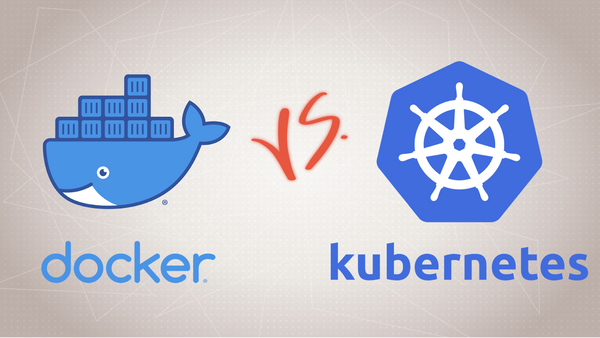
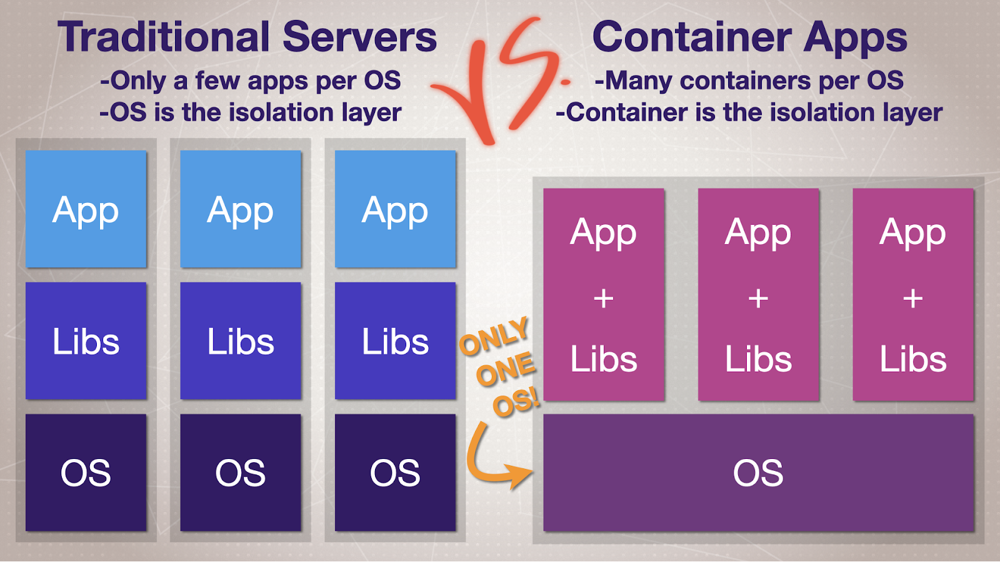
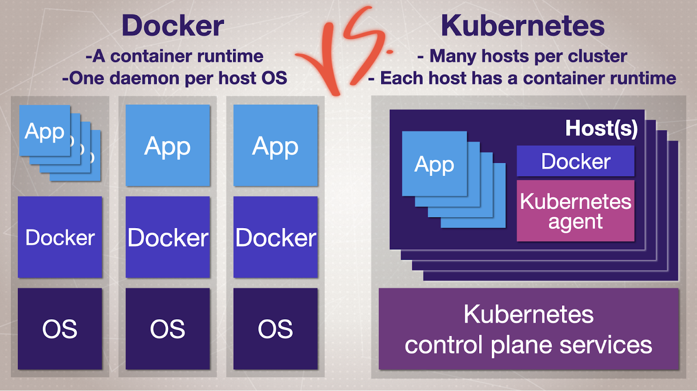

# Kubernetes vs Docker

> Nav: [🔙 Back](./readme.md)

Versus isn’t the right question. Using these tools isn’t an either-or equation. Let's break down their origin, purpose, and how to use the right tool for the job.

Consider these definitions:
- **Docker Engine is a “container runtime.”** It knows how to run and manage containers on a single operating system host. You must control each host separately.
- **Kubernetes (K8s) is an open-source “container orchestration platform” (AKA orchestrator).** It knows how to manage containers across many operating system hosts, which in turn, run their own container runtime.

## Docker origins

In 2013, Solomon Hykes, CEO of Dotcloud, announced the Docker open source project. When it hit 1.0 in 2014, I gave it a try. It was “love at first deploy.”

The more I understood about its features, the more I wanted to use Docker everywhere.

The concept of containerized applications – using containers to isolate many apps from each other on a single server – has existed for decades. Yet, there wasn’t an easy-to-use tool that focused on the full application lifecycle until Docker.

The team that created Docker took complex tools and wrapped them in a command-line interface (CLI) that mere mortals could understand.

## What’s Docker Engine got to do with Docker?
Soon after Docker’s release, the founders scrapped Dotcloud and created Docker Inc. They now make a line of products with Docker in the name.

In this post, we’ll focus on the original project, now called Docker Engine. This is what people are usually talking about when they say “Docker,” and what I’ll refer to by default in this article.

Note that Docker also makes [Docker Desktop](https://www.docker.com/products/docker-desktop/), a bundle of products for Windows and Mac. **Docker Desktop is the easiest way to run Docker and Kubernetes on your local machine for dev and testing server apps. Millions of people use it every month, and I recommend it.**

## Docker’s main innovations
1. **Easy Packing** -> Docker takes your application and all of its software dependencies – minus the OS kernel and hardware drivers – and bundles them in a set of tarballs (similar to zip files). **The app tarball(s) and metadata are known together as a container image. This is now considered the modern way to package server apps.**

2. **Easy app running** -> Docker runs each container in an isolated file system. Each container gets its own networking and resource limits and can’t see anything else on the host operating system. It can do this in a single, short command.

3. **Easy app distribution** -> Docker created the idea of a “container image registry,” which allows you to store images in a central HTTP/S server and push/pull them as easily as doing so with git commits. The most popular registry is [Docker Hub](https://hub.docker.com/) and you can find many open source projects with official images there.

## Why Do We Need Kubernetes?
You’ll find that once you start using containers, you’ll want to use them everywhere – and once you have more than a few servers, you’ll start wishing for an easier way to run multiple related containers for your apps.

With Docker, you still need to manually set up networks between servers, including security policies, DNS, storage, load balancers, backups, monitoring, and more. When it comes to dozens of related containers, this creates as much work (if not more) as we had before containerized applications.

This multi-server problem is what the Kubernetes founders wanted to solve. They knew that in order to make production container systems as easy as Docker is for a single machine, they needed to address the underlying hardware and network resources. **Kubernetes is an open-source multi-server clustering system. It orchestrates all the tools required for a real-world solution hosting dozens, hundreds, or even thousands of apps.**

**Kubernetes is to a group of servers what Docker is to a single server.** It’s a set of programs and APIs that control many Docker Engines from one CLI.

**Kubernetes’ main job is to tell Docker what to do, yet it now provides an increasing number of related duties.** Other built-in features include container health checks, auto-replacing failed apps, automating web proxy configurations, managing network security policies, and even auto-provisioning external storage.

## Using Docker with Kubernetes
Now that you know where these tools come from and what problems they solve, the question is: Should you use them together?

If you only need to control containers on a single machine, and you’re new to containers, Docker is the best choice. Keep it simple to start, and you can grow into an orchestrator later. If you need to run multiple containers for your apps, it may be time to consider Kubernetes.

**Remember, tools aren’t the end goal.** Regardless of whether you choose Docker, Kubernetes, or serverless, remember that the tool isn’t the ultimate objective. Always keep your business’s DevOps goals in mind, and try not to get distracted by the “shiny” appeal of advanced tools just for the sake of using cool new tech.

> Nav: [🔙 Back](./readme.md)