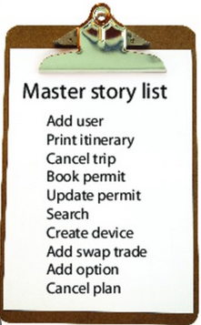
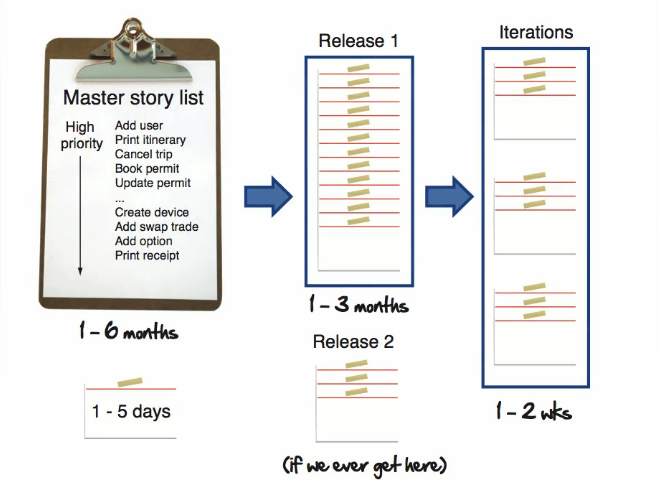

# **RESUMO** / **The Agile Bootcamp**

1. 

        

            Introduction
        

        

            Agile is a way of developing software that reminds us that although computers run the code it's people like you and me who create and maintain it.
        

        

            It's a framework software delivery that is lean, fast and pragmatic.
        

        <h3>Definition</h3>
        

            Agile methodologies are a set of practices and principles used in software development and project management that prioritize flexibility, collaboration, and iterative development. The goal of agile methodologies is to deliver high-quality products that meet customer needs and are adaptable to changing requirements, while minimizing waste and maximizing efficiency.
        

        

            Agile methodologies originated in response to traditional project management methods, which often led to rigid planning, siloed teams, and long development cycles that made it difficult to respond to changing customer needs. In contrast, agile methodologies emphasize continuous communication, collaboration, and feedback between team members and stakeholders, as well as regular delivery of working software.
        

        <h3>Traditional vs Agile</h3>
        
        &nbsp;
        <h3>Popular frameworks</h3>
        

            1. Scrum: is a popular framework for Agile software development that emphasizes teamwork, collaboration, and iterative progress. Scrum involves a set of roles, ceremonies, and artifacts that help teams to plan, execute, and review their work, including daily stand-up meetings, sprint planning, sprint reviews, and retrospectives.
        

        

            2. Kanban: is a framework that focuses on visualizing work, limiting work in progress, and optimizing workflow. It involves using a Kanban board to visualize the flow of work through various stages, setting a limit on the number of tasks in progress, and continuously improving the process.
        

        

            3. Lean: is a framework that originated in manufacturing and has since been adapted to software development. It involves optimizing the process to eliminate waste, improve flow, and increase efficiency. Lean principles include value stream mapping, continuous improvement, and just-in-time delivery.
        

        

            4. Extreme Programming (XP): is a framework that emphasizes teamwork, communication, and rapid feedback. XP involves a set of practices, such as pair programming, test-driven development, and continuous integration, that help teams to deliver high-quality software quickly.
        

    

2.  

        
Estimation

        
        <blockquote>
            The primary purpose of software estimation is not predict a project's outcome;
            it is to determine wether a project's targets are realistic enough to allow the
            project to be controlled to meet them.
        </blockquote>
        
Is this project even possible given the time and resources that I've got?

        
What I need to estimate is following:

        
1. Something that to allows us to planning the future;

        
2. Remind us that my estimates are guesses;

        
3. Recognize the inherent complexities that
            come when creating custom based software.
        

        

            Agile methodologies typically use estimation techniques that are based on relative sizing rather than absolute time or effort. One common technique for estimating tasks in Agile is called "story points."
        

        

            To estimate a task with story points, the team will consider several factors that contribute to the overall complexity and effort required to complete the task, such as:
        

        
1. The amount of work required to complete the task.

        
2. The complexity of the task.

        
3. The level of uncertainty or risk associated with the task.

        
4. The level of collaboration or coordination required with other team members.

        
The team will then assign a story point value to the task based on its relative size and effort required, using a scale that is agreed upon by the team. For example, a common scale might be:

        
0 NUTS[^1]: Trivial or insignificant task that requires very little effort.

        
1 NUTS: Very small or simple task that can be completed quickly.

        
3 NUTS: Moderate task that requires more effort and might take a day or two.

        
5 NUTS: Large task that requires significant effort and might take several days.

        
Once the team has estimated the story point value for the task, they can use this value to help them plan and prioritize their work. They can also use the estimated story point values to track their progress and adjust their plans as needed based on their actual progress.

        
It's worth noting that story points are not a measure of time, and cannot be used to predict an exact completion date. Rather, they are a tool for the team to understand the relative effort required for each task, and to help them plan and prioritize their work accordingly. The team will typically monitor their progress throughout the project, and adjust their estimates and plans as needed based on their actual progress.

        <h3>If I don't know estimate something?</h3>
        
In Agile methodologies, a spike is a type of time-boxed task that is used to explore and research a new concept or technology in order to gain enough information to estimate a user story or task accurately. Spikes are typically short-term tasks that last for a few hours or a few days, depending on the complexity of the problem being investigated.

        
The purpose of a spike is to reduce uncertainty and risk by providing the team with the information they need to make informed decisions and estimate future work accurately. Spikes are useful when the team encounters a task or user story that they don't know how to estimate due to lack of knowledge or experience.

        
During a spike, the team will perform research, conduct experiments, and create prototypes in order to gain a better understanding of the problem or technology in question. Once the spike is complete, the team can use the information they gathered to estimate the user story or task more accurately.

        
Spikes are often used in Agile development when the team needs to investigate a new technology, framework, or process. They can also be used to investigate complex user stories or tasks that the team is not familiar with.

        
It's important to note that spikes are time-boxed, which means that they have a fixed duration and should not be allowed to overrun. This helps to ensure that the team does not spend too much time on research and investigation and can move on to the next task or user story in a timely manner.

        
[^1]: Nebulous Units of Time.

    

3.  

        
Planning

        
The speed at which we can turn user stories into working software is called the team velocity. It's what we use for measuring or team's productivity and for setting expectations around delivery dates in the future.

        
We don't know our team's velocity at the beginning of the project and until we build something of value and measure how long that takes, we won't know how realistic our dates are looking.

        
Agile methodologies are designed to be flexible, and they provide mechanisms for managing changes to scope during the project. One way to manage changes in scope is through a process known as "flexing".

         
        
Flexing involves adjusting the scope of a project based on changing requirements.

        
1. Prioritization: By prioritizing requirements, the team can focus on completing the most important tasks first, and delay less critical tasks until later. This allows the team to deliver a working product or feature within the original timeframe and budget.

        
2. Incremental delivery: Agile methodologies promote delivering software in small increments or iterations. By delivering working software early and often, the team can get feedback from stakeholders and make adjustments to the scope as needed.

        
3. Incremental delivery: Agile methodologies promote delivering software in small increments or iterations. By delivering working software early and often, the team can get feedback from stakeholders and make adjustments to the scope as needed.

        
Overall, flexing is an important tool for managing changes in scope in Agile projects. It allows the team to adapt to changing requirements and deliver a high-quality product or feature within the original timeframe and budget.

         
        <h3>First plan</h3>
        

            

                1. Create Master Story List
            

            

                Obs: The master story list is a collection of user stories, or features, your customer is going to want to see in their software.
            

            
             
             
            
A release is a logical grouping of stories that make sense to your customer.

            
            
In the Agile manifesto, the principle of simplicity is stated as:

            
'Simplicity: the art of maximizing the amount of work not done -- is essential.'

            
the principle of simplicity in Agile methodologies is about focusing on the essentials, reducing waste, and keeping things simple. By following this principle, teams can deliver high-quality software that meets the needs of the customer, while avoiding unnecessary complexity and waste.

        

        

            

                2. Make an Assessment of Problem
            

        

        

            

                3. Prioritize
            

        

        

            

                4. Estimate the team velocity
            

            <ol>
                <li>Be Conservative</li>
                <li>Remind everyone this is a guess</li>
                <li>Start measuring from first day</li>
            </ol>
        

        

            

                5. Pick Some Dates
            

            <ol>
                <li>Delivery by date</li>
                <li>Delivery by feature set</li>
            </ol>
        

    

4. 

        
Iteration

        

            
Steps to turn stories into software

            <ol>
                <li>Making the work ready(Analysis and Desing)</li>
                <li>Doing the work(Developement)</li>
                <li>Checking the work(Testing)</li>
            </ol>
        

    

5. 

    
Communication Plans

    
How to create your own communication plan?

    <ul>
        <li>Setting Expectations</li>
        <li>Getting Feedback</li>
    </ul>
     
    
Good Habits

    <ul>
        <li>Meet Regularly</li>
        <li>Review we are doing</li>
    </ul>
     
    
Four things to do each Iteration

    <ol>
        <li>Make sure the work is ready</li>
        <li>Feedback on last iterations stories</li>
        <li>Plan next iteration work</li>
        <li>Look for areas of improvement</li>
    </ol>
    

6. 

    
Software Engineering

        

            
Unit Test

            
Small tests developers write everyday to prodve their code is working.

             
            
The Benefits of Unit Testing are Huge

            <ol>
                <li>Give instant feedback</li>
                <li>Lower cost of regression testing</li>
                <li>Faster debugging</li>
                <li>Deploy with confidence</li>
            </ol>
        

        

            
Refactoring

            
Practice of making small incremental improvements to the software without changing the overall external behavior.

             
            
When I need reafactoring?

            
Technical Debt

            <ol>
                <li>Spaghetti code</li>
                <li>Excess complexity</li>
                <li>Duplication</li>
            </ol>
             
            
Pros Refactoring

            <ol>
                <li>Communicate clearly</li>
                <li>Easy to understand</li>
                <li>Easy to change</li>
            </ol>
             
            
Continuos attetion to technical excellence and good design enhances agility.

        

        

            
Test-Driven Development

            
...

             
            
When I need reafactoring?

            
Technical Debt

            <ol>
                <li>Spaghetti code</li>
                <li>Excess complexity</li>
                <li>Duplication</li>
            </ol>
             
            
Pros Refactoring

            <ol>
                <li>Communicate clearly</li>
                <li>Easy to understand</li>
                <li>Easy to change</li>
            </ol>
             
            
Continuos attetion to technical excellence and good design enhances agility.

        

    

